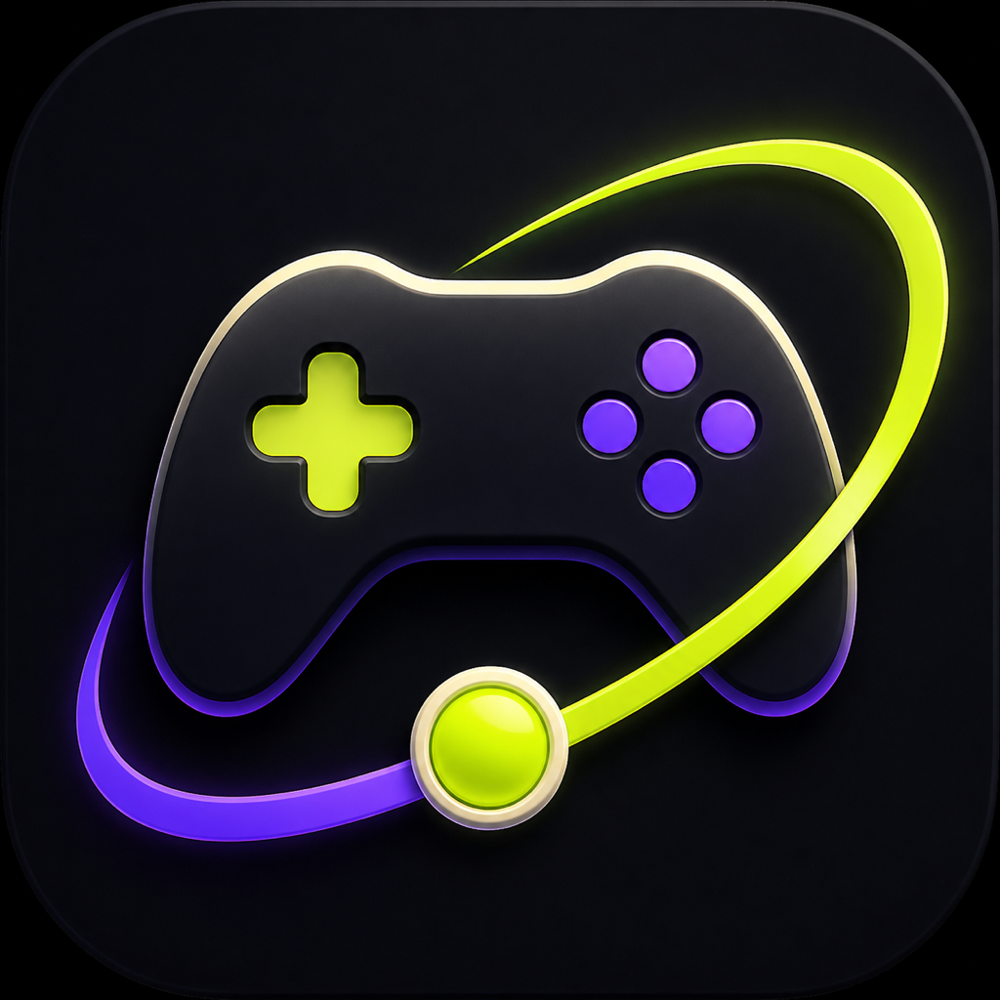
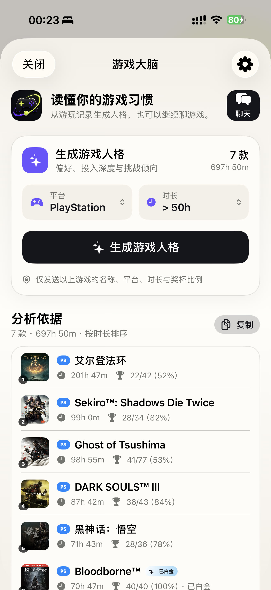
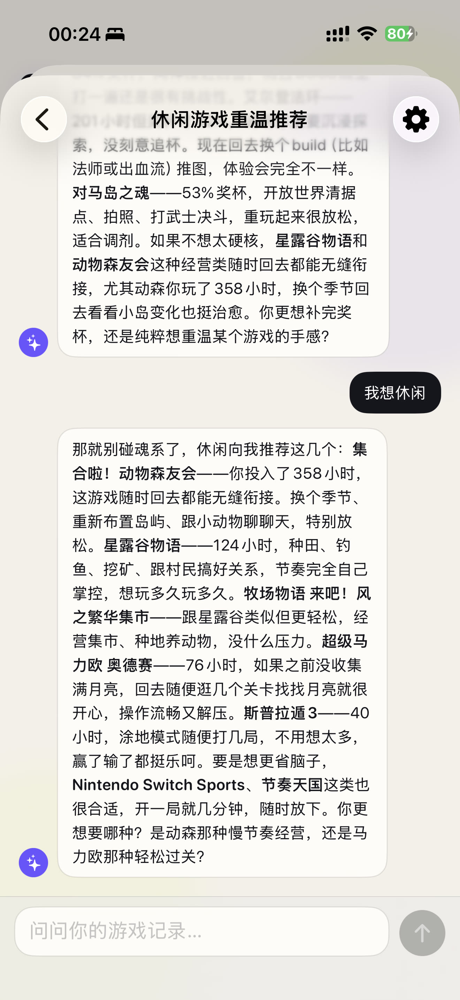
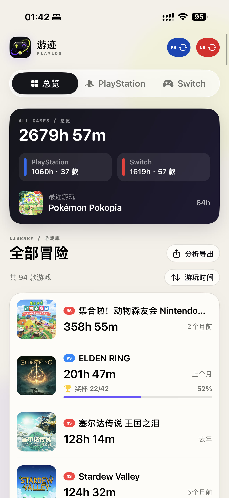
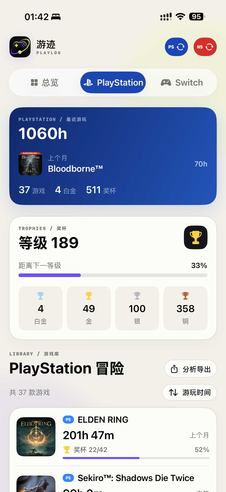
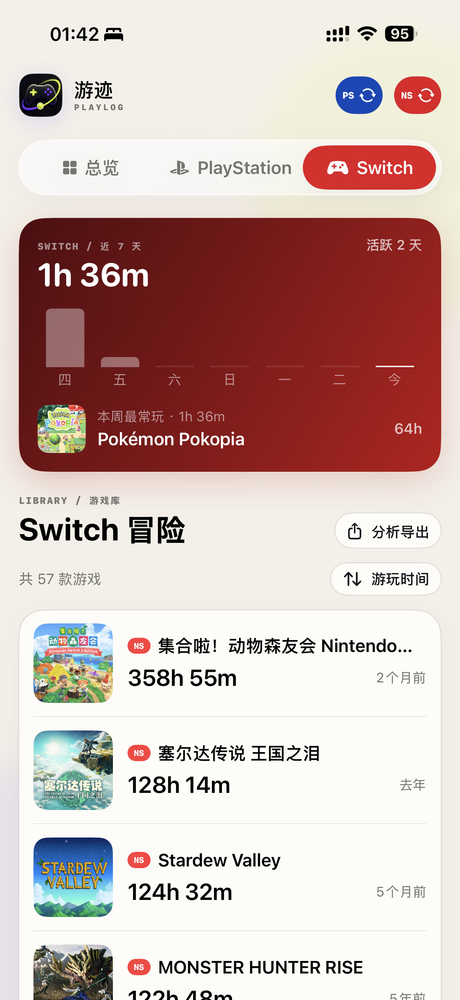

<p align="center">
  
</p>

<p align="center">
  <a href="README.md">English</a> · 简体中文
</p>

<h1 align="center">游迹</h1>

<p align="center">
  <strong>你的游戏大脑</strong>
</p>

<p align="center">
  把散落在 PlayStation 与 Nintendo Switch 的游戏经历，变成一份懂你的长期档案。
</p>

游迹为主机玩家整理真正玩过的游戏、投入的时间和获得的奖杯，并让 AI 在这些经历之上认识你。它不只告诉你玩了多久，也帮你看见自己的偏好、习惯，以及下一段值得出发的冒险。

## App 截图

<p align="center">
  <strong>游戏大脑</strong>
</p>

<p align="center">
  
  
</p>

<p align="center">
  <strong>本地游戏档案</strong>
</p>

<p align="center">
  
  
  
</p>

## 它懂的不是标签，是你的游戏经历

### 看见自己的游戏人格

从真正投入过的作品中，读出你的核心偏好、投入深度与挑战倾向。你可以自由选择平台和范围，让每一次分析都回答当下真正关心的问题。

### 和一个了解你的 AI 聊游戏

不用整理清单，也不用反复解释自己玩过什么。你可以直接问它：我为什么喜欢魂系？最近适合重温什么？下一款游戏该选哪一个？它会结合你的游戏经历和此前对话，给出属于你的回答。

### 留住每一次有价值的对话

聊天会保存在本地，并自动整理成容易找回的主题。你可以随时继续、新建或删除，让每一段有价值的讨论都能自然接着聊。

## 一份真正属于你的主机档案

- **跨平台总览**：把 PlayStation 与 Nintendo Switch 放进同一个游戏库，时间、数量和最近游玩一眼看清。
- **奖杯与白金**：回顾 PlayStation 奖杯进度、完成率与白金作品，看见每一次认真投入。
- **近期活动**：查看 Switch 最近 7 天的游戏节奏，知道这周的时间去了哪里。
- **游玩日历**：每次同步后长期保存 Switch 的具体游玩日期、游戏与分钟数，超出七日窗口后仍可回看。
- **清晰但完整的首页**：保留跨平台总览和完整游戏库，在总览卡内用小型快捷入口查看洞察或游戏大脑；待玩清单收进更多菜单，Switch 每日记录只在 Switch 页面展示。
- **更干净的收藏**：自动弱化短暂试玩和很久没碰的游戏，把真正重要的作品留在眼前。
- **长期可回看**：同步只在你需要时发生，游戏封面和历史记录留在本机，越用越完整。

## 三步开始

1. 连接你的 PlayStation 或 Nintendo Account。
2. 主动同步游戏记录，建立自己的跨平台游戏库。
3. 打开“游戏大脑”，生成人格或聊聊下一段游戏计划。

AI 能力使用你自己的模型配置，首次使用时在设置中填写即可。

## 你的数据，始终由你决定

- 游戏记录和聊天内容优先保存在本机。
- 只有你主动同步或发送消息时，游迹才会访问对应服务。
- 账号凭据与 AI API Key 由系统安全保存，不会出现在仓库或游戏档案中。
- AI 只获得完成当前分析或对话所需的信息，不会接触你的平台凭据。

---

## 开发与运行

### 环境

- iOS 17+
- Xcode 26（推荐）
- Swift 6

### 运行项目

1. 克隆仓库并打开 `YouJi.xcodeproj`。
2. 在 Xcode 的 **Signing & Capabilities** 中选择自己的开发团队。
3. 安装到真机时，将 Bundle Identifier 改为自己账号下的唯一值。
4. 选择 `YouJi` Scheme 后运行。

```bash
xcodebuild \
  -project YouJi.xcodeproj \
  -scheme YouJi \
  -destination 'platform=iOS Simulator,name=iPhone 17 Pro' \
  build
```

模拟器适合浏览界面；实际同步需要在真机上完成平台账号授权。

### 实现

- SwiftUI：界面与交互
- SwiftData：本地游戏记录、同步快照和 AI 会话
- Swift Charts：Switch 近 7 天活动
- AuthenticationServices / WebKit：平台网页登录
- Keychain Services：平台会话令牌与用户填写的 AI API Key
- URLSession：OpenAI Chat Completions 兼容的 AI 文本分析
- CryptoKit：封面缓存文件名

游戏封面保存在 `Application Support/YouJi/Covers`，平台令牌使用 `AfterFirstUnlockThisDeviceOnly` 级别写入 Keychain。

### 项目结构

```text
YouJi/
├── Assets.xcassets/       # App 图标与品牌资源
├── Design/                # 颜色与通用视图样式
├── Models/                # SwiftData 游戏、快照与 AI 会话模型
├── Services/              # 平台同步、AI 分析、Keychain 与封面缓存
├── Views/                 # 首页、登录、AI 分析、游戏聊天和设置
└── YouJiApp.swift         # App 入口

docs/
├── ARCHITECTURE.md        # 数据流、存储与同步设计
└── screenshots/           # README 截图（JPG，已移除 EXIF）

YouJiTests/                # 数据模型与解析回归测试
```

当前产品范围、用户路径、真机页面图谱和缺口优先级见 [产品需求文档](docs/PRD.md)，详细的数据流和平台同步逻辑见 [架构说明](docs/ARCHITECTURE.md)。

使用 AI 协助开发前，请先阅读 [AI 贡献指南](AGENTS.md)，其中记录了产品不可变约束、数据安全边界与验证方式。

### 接口说明

PlayStation 与 Nintendo 的游戏记录接口都不是面向第三方开发者的稳定公开 API。平台升级后，请优先检查：

- `YouJi/Services/PlayStationAPIClient.swift`
- `YouJi/Services/NintendoAPIClient.swift`

## 免责声明

本项目为个人学习与自用项目，与 Sony Interactive Entertainment 或 Nintendo 无关联。PlayStation、PS4、PS5、Nintendo Switch 及相关商标归各自权利人所有。

## 许可证

本项目使用 [MIT License](LICENSE)。
