# 游迹（YouJi）产品需求文档

> 文档类型：现状型 PRD + 产品缺口评审  
> 产品阶段：1.0 能力基线 / 对外发布前完善  
> 更新日期：2026-08-22  
> 适用平台：iPhone，iOS 17+

## 1. 产品概述

### 1.1 一句话定义

游迹是一款面向 PlayStation 与 Nintendo Switch 玩家的本地优先游戏档案工具：它把分散在不同平台的游玩时长、最近活动和奖杯记录整理成可长期回看的个人游戏库，并基于这些真实经历提供 AI 人格分析、游戏对话与下一步游玩计划。

### 1.2 产品愿景

让玩家拥有一份真正属于自己的游戏经历，而不只是散落在平台账号里的统计数字。

### 1.3 核心价值

1. **统一**：把 PlayStation 与 Switch 记录放进一个跨平台游戏库。
2. **积累**：主动同步后把平台的短期数据沉淀为长期本地档案。
3. **理解**：从时长、奖杯、活跃变化中认识自己的偏好和节奏。
4. **行动**：把洞察或 AI 建议转化为待玩、重温和继续游玩的计划。
5. **可控**：数据本地优先，何时联网、导出、恢复和删除均由用户决定。

## 2. 背景与用户问题

### 2.1 背景

主机玩家的游戏记录天然分散在不同平台。平台通常更关注当前账号内的商店、社交与近期活动，不适合长期整理跨平台经历。Switch 的逐日活动窗口尤其短，PlayStation 奖杯与时长又属于另一套数据体系。

大多数第三方游戏库依赖用户手动维护，实际游玩时长、最近活动和奖杯信息很难持续准确。通用 AI 推荐则不了解用户真实投入过的游戏，回答容易退化成热门榜单或类型标签。

### 2.2 需要解决的核心问题

- 我在不同主机上到底玩过什么、投入了多少时间？
- 最近一周、一个月或一年，我的游玩节奏发生了什么变化？
- 哪些作品真正构成了我的偏好，哪些只是短暂试玩？
- 面对积压的游戏和有限时间，下一款该玩什么、哪款值得重温？
- 当平台只保留短期活动或接口发生变化时，如何保住自己的长期档案？
- 如何在获得 AI 帮助的同时，不交出平台凭据和完整私人数据库？

## 3. 目标用户

### 3.1 核心用户

**跨平台主机玩家**

- 同时拥有 PlayStation 与 Switch，或长期使用其中一个平台。
- 游戏数量较多，关心累计时长、奖杯、最近活动和个人历史。
- 愿意主动同步，但不希望应用在后台持续访问账号。
- 对游戏推荐有需求，但希望推荐基于自己的真实经历。

### 3.2 次级用户

**奖杯与完成度玩家**

- 关注白金、奖杯比例、完成进度和阶段性变化。
- 希望快速找到高完成度或值得补完的作品。

**数字档案型玩家**

- 重视本地保存、备份、可迁移和长期回看。
- 会收藏、写备注、维护游戏状态和游玩计划。

### 3.3 暂非目标用户

- 需要实时社交动态、好友排行或多人组队的用户。
- 以 PC、Xbox、移动游戏为主要平台且不使用 PS/Switch 的用户。
- 希望应用自动后台同步、无需任何主动操作的用户。
- 需要精确到秒、可替代平台官方统计或作为竞技证明的用户。

## 4. 用户任务（JTBD）

| 场景 | 用户想完成的任务 | 成功结果 |
| --- | --- | --- |
| 第一次使用 | 连接已有平台并快速看到自己的历史 | 首次同步完成，首页出现可信的个人游戏库 |
| 日常回访 | 看本周玩了什么、比上次多了什么 | 看到近期活动、同步变化和活跃游戏 |
| 回顾作品 | 查一款游戏的投入、奖杯和时间线 | 打开长期档案并补充收藏、状态或备注 |
| 认识自己 | 从真实游玩记录总结偏好与习惯 | 得到可保存、可分享、可继续追问的人格分析 |
| 决定下一步 | 从历史与积压中选择下一款游戏 | 将建议保存为明确的待玩或重温计划 |
| 更换设备/账号 | 保留或恢复自己的本地历史 | 备份可迁移，不串账号、不包含凭据 |

## 5. 产品定位与原则

### 5.1 产品定位

游迹不是游戏资讯、商店或社交社区，而是“本地优先的个人游戏大脑”。其差异化来自三件事的组合：

- 跨 PlayStation / Switch 的真实平台记录；
- 随主动同步持续积累的本地长期档案；
- 只使用必要字段、基于个人经历的 AI 理解和行动建议。

### 5.2 产品原则

1. **先可信，再聪明**：数据新鲜度、来源和缺失原因必须能解释。
2. **用户主动触发联网**：连接、同步、AI 生成和发送都必须由用户发起。
3. **AI 是增强，不是门槛**：未配置 AI 时，档案、洞察和数据管理仍完整可用。
4. **长期积累不等于平台真相**：明确区分平台累计值、同步快照和精确逐日数据。
5. **账号绝不串档**：游戏、AI 内容、洞察和计划均按当前账号范围隔离。
6. **中国用户优先**：文案简洁、中文优先，游戏名优先采用官方中文名称。
7. **不以功能数量替代闭环**：新增能力应服务“同步—看见变化—理解—行动—再次回访”。

## 6. 产品目标与非目标

### 6.1 当前阶段目标

- 用户能连接至少一个平台并建立可持续更新的本地游戏库。
- 用户能确认当前账号、最后同步时间、本次变化和部分失败情况。
- 用户能搜索、筛选和管理大型游戏库，而不被短试玩淹没。
- 用户能从同步快照和 Switch 每日记录看到长期变化。
- 用户能在明确知情和主动操作下使用 AI 人格与聊天。
- 用户能导出、恢复和删除自己的本地数据。

### 6.2 当前阶段非目标

- 后台或定时自动同步游戏平台。
- 账号密码托管、云端代理同步或服务端集中存储游戏库。
- 好友、排行榜、动态流、评论和公共社区。
- 游戏购买、价格跟踪或商店导购。
- 用非精确数据推断 PlayStation 的逐日游玩分钟。
- 替代游戏平台官方数据或承诺第三方接口永久稳定。

## 7. 核心产品闭环

```text
连接平台
   ↓
主动同步并建立档案
   ↓
看见本次变化与近期活动
   ↓
进入游戏详情 / 洞察 / AI 理解
   ↓
收藏、备注或保存待玩/重温计划
   ↓
提醒用户在合适时间再次主动同步
```

当前版本已具备闭环中的各项能力，并已通过总览卡内的轻量快捷入口完成第一阶段串联。洞察与游戏大脑紧邻总览结论，但不再占用独立内容区。后续重点是让首次用户更快理解价值，并让同步失败时的恢复路径同样清楚。

## 8. 信息架构

### 8.1 当前一级入口

- 首页总览：跨平台概况、总览卡内的洞察/游戏大脑快捷入口和完整统一游戏库；同步回执留在对应平台页与账号中心，待玩清单收进更多菜单。
- PlayStation：最近游玩、同步变化、奖杯汇总和 PS 游戏库。
- Switch：近 7 天活动、同步变化、Switch 游玩日历和 Switch 游戏库。
- AI：游戏人格、分析依据、人格历史与游戏聊天。
- 更多菜单：账号与同步、待玩与重温、设置；洞察与游戏大脑保留为总览可见入口。

### 8.2 二级页面

- 游戏档案：时长、时间线、奖杯/每日活动、收藏、隐藏、状态、备注。
- 账号与同步：当前连接、同步回执、本地历史档案、断开与删除。
- 游玩洞察：7 天、30 天、年度变化；可进入周期详情查看月度分布、游戏与奖杯贡献，并继续打开单款游戏档案。
- 待玩与重温：手动计划或 AI 灵感。
- 设置：AI 服务、同步提醒、数据管理、隐私、诊断与反馈。
- 数据管理：JSON 备份/恢复、CSV、诊断、删除全部本地档案。

## 9. 页面图谱与真机截图

以下截图采集自 iPhone 17 Pro Max 上的当前版本，保留真实数据状态与系统状态栏，用于评审页面层级和信息密度。图片统一保存在 `docs/screenshots/prd/`。设置页、登录授权页、API Key、完整账号 ID 和安全诊断内容未纳入文档。

### 9.1 游戏库首页

| 总览 | PlayStation | Switch |
| --- | --- | --- |
| 跨平台总时长、平台分布、最近游玩和统一游戏库。 | PS 总时长、同步变化、奖杯汇总与奖杯进度。 | 近 7 天节奏、本周主玩游戏与 Switch 游戏库。 |
| 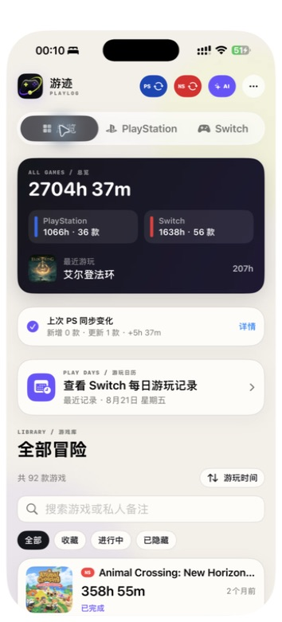 | 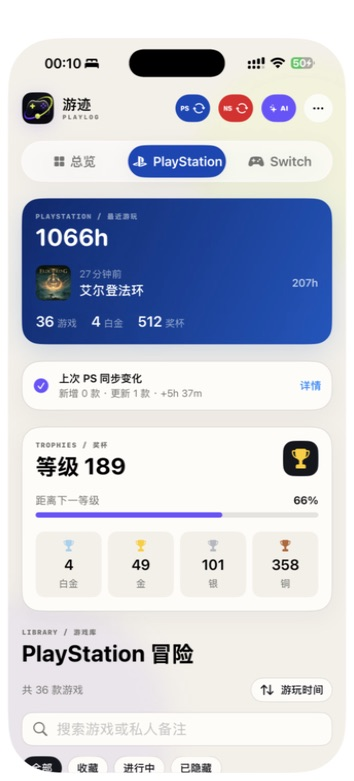 | 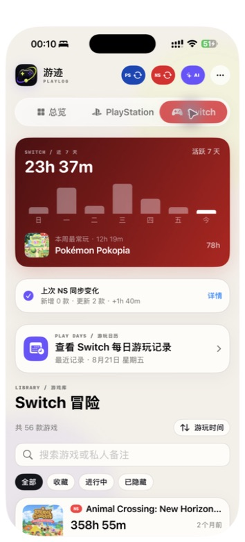 |

### 9.2 日历与单款档案

| Switch 游玩日历 | Switch 游戏档案 |
| --- | --- |
| 按日期保留具体游戏和分钟，超出平台七日窗口后仍可回看。 | 管理收藏、隐藏、状态和备注，并查看长期时长与每日活动。 |
| 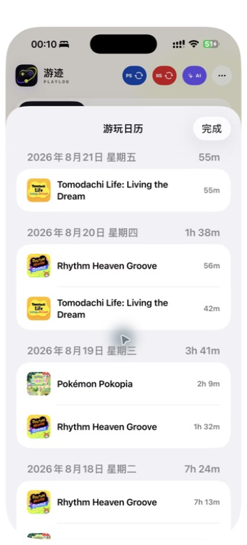 | 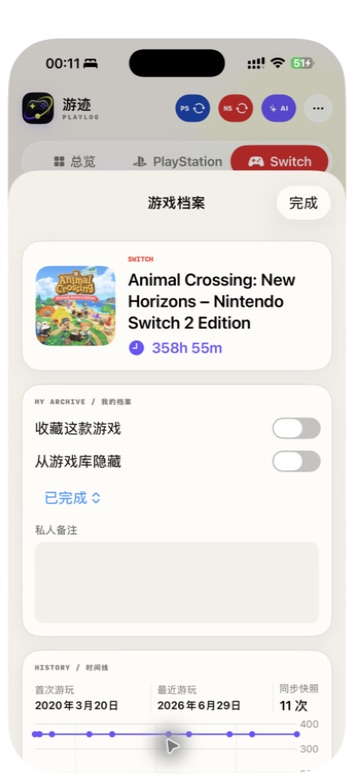 |

| PlayStation 游戏档案 | PlayStation 时间线与奖杯 |
| --- | --- |
| 展示单款游戏的核心投入和本地自定义档案。 | 用同步快照展示累计变化，并保留奖杯进度和更新时间。 |
| 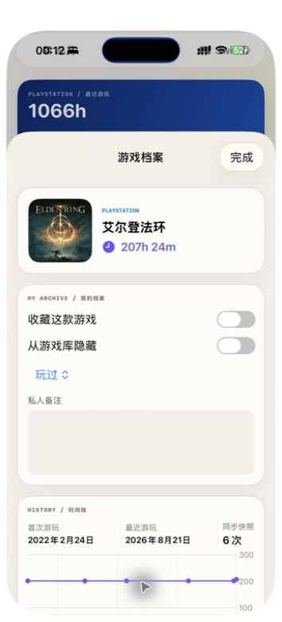 | 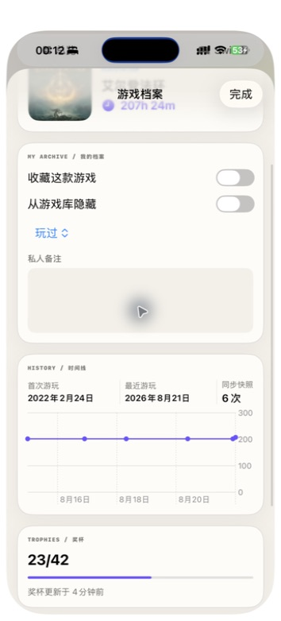 |

### 9.3 回看与行动

| 账号与同步 | 游玩洞察 | 待玩与重温 |
| --- | --- | --- |
| 确认当前身份、数据新鲜度、同步变化和本地历史档案。 | 汇总 7 天、30 天和年度变化，并解释快照数据来源。 | 承接手动计划和 AI 灵感；当前截图也体现了清单为空时的引导。 |
| 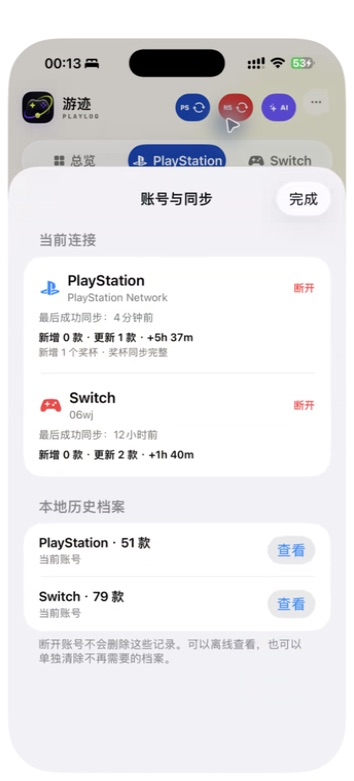 | 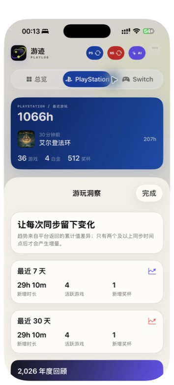 | 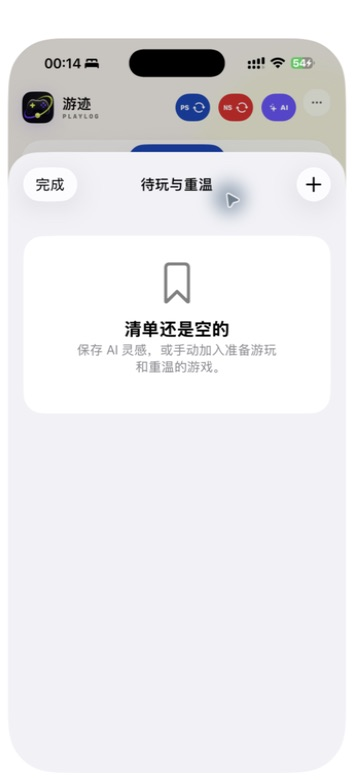 |

### 9.4 游戏大脑

| 人格分析 | 历史游戏人格 |
| --- | --- |
| 用户确认平台、最低时长与分析依据后主动生成。 | 按账号范围保存历次结果，支持再次阅读与生成分享图。 |
| 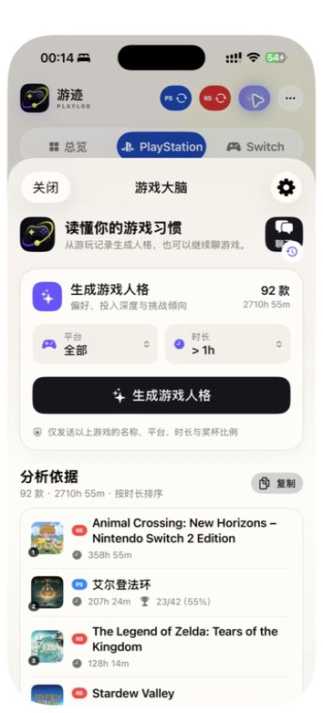 | 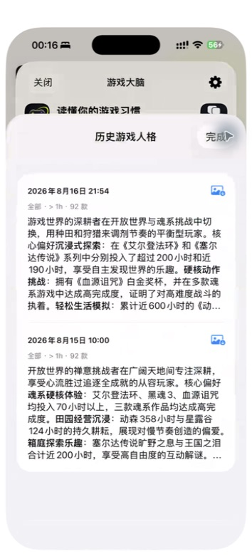 |

| 游戏聊天列表 | 多轮游戏聊天 |
| --- | --- |
| 保存、继续、新建和删除同一账号范围的对话。 | 基于创建时冻结的游戏上下文回答，并支持继续追问。 |
| 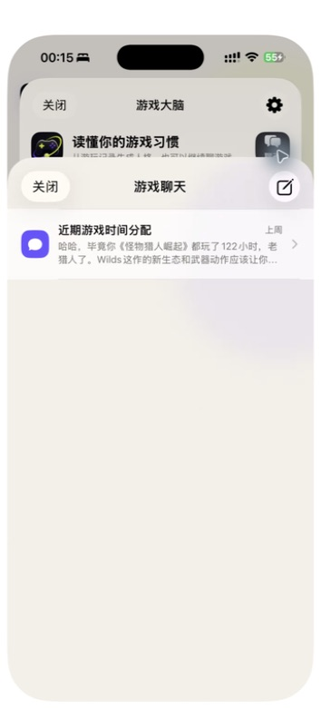 | 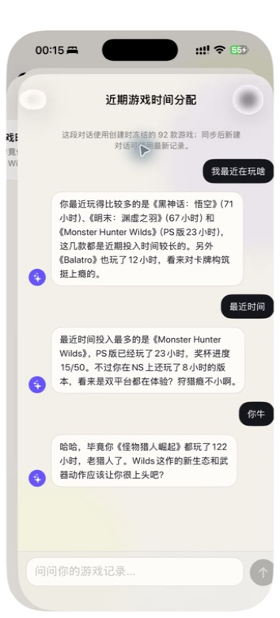 |

### 9.5 数据控制与隐私

| 数据管理 | 数据与隐私 |
| --- | --- |
| 完整 JSON 备份、CSV、合并恢复、诊断和本地删除。 | 解释本机保存、联网时机、AI 字段范围和用户控制。 |
| 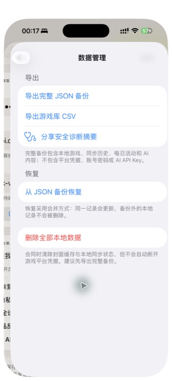 | 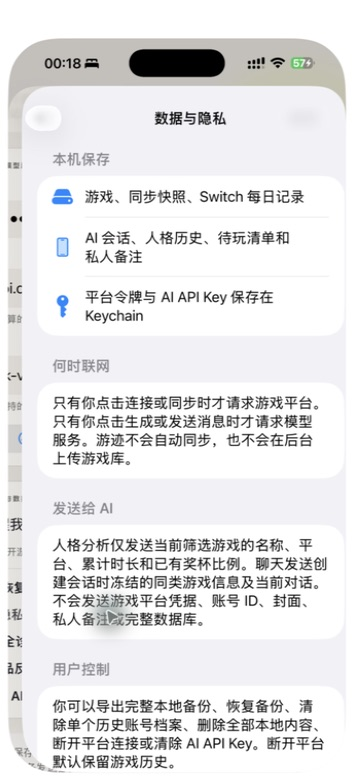 |

## 10. 功能需求

### FR-01 平台连接与主动同步

**需求**

- PlayStation 与 Switch 必须有独立连接和同步入口。
- 未连接时点击平台按钮进入授权；已连接时点击发起该平台同步。
- 同一时间只执行一个同步任务，避免重复写入和状态冲突。
- 显示当前连接身份、最后成功同步时间和本次变化。
- 认证失效时清除受影响平台凭据并引导重新连接；不得影响另一平台。
- 断开连接只移除凭据和当前身份，不静默删除本地历史。

**验收**

- 用户不点击连接或同步时，不发生平台远程请求。
- PlayStation 游戏列表先于奖杯完整性落库；单款奖杯失败不阻塞游戏库更新。
- Nintendo 重复同步不会删除已滚出 7 天窗口的历史每日记录。
- 部分失败、认证失效和普通网络失败能被区分处理。

### FR-02 跨平台游戏库

**需求**

- 支持总览、PlayStation、Switch 三个视图。
- 默认按总时长降序，时长相同时按最近游玩排序。
- 支持最近游玩排序；PlayStation 支持奖杯排序。
- 支持按游戏名或私人备注搜索。
- 支持全部、收藏、进行中、已隐藏等范围。
- 游玩不足 60 分钟且超过 6 个月未玩的记录默认隐藏，但不得删除。
- Switch 行不显示奖杯或完成度；PlayStation 白金有明确标记。

**验收**

- 平台切换不混合专属信息。
- 手动隐藏和自动隐藏的游戏都可以被找回并恢复显示。
- 奖杯排序依次为白金优先、完成比例、游玩时长。

### FR-03 单款游戏档案

**需求**

- 展示封面、名称、平台、总时长、首次/最近游玩和同步次数。
- 两次及以上同步后展示累计时长时间线。
- PlayStation 展示奖杯数量、比例、白金和奖杯更新时间。
- Switch 展示长期保存在本机的逐日活动。
- 支持收藏、手动隐藏、始终显示、游玩状态和私人备注。
- 支持从游戏档案直接加入当前账号范围的待玩与重温清单。
- 所有自定义信息只保存在本机，不回写游戏平台。

### FR-04 活动日历与游玩洞察

**需求**

- 首页展示 Switch 最近 7 天活动和本周最常玩游戏。
- Switch 游玩日历按日期展示具体游戏和分钟。
- 洞察展示最近 7 天、30 天和本年度的新增时长、活跃游戏和新增奖杯。
- 洞察只能使用相邻同步快照差值，不得用累计总量伪装区间增量。
- 数据不足时说明需要继续同步，不输出虚假的趋势结论。
- 展示已记录同步日、覆盖起止时间，并明确区分完整周期与局部覆盖。
- 7 天、30 天和年度卡片均可进入周期详情；详情按增量排序展示游戏时长与奖杯贡献，年度详情补充月度变化。
- 洞察游戏贡献可继续打开对应游戏档案；跨月未同步的变化必须说明会归入下一次同步所在月份。

### FR-05 AI 游戏人格

**需求**

- 用户可按全部/PS/Switch与严格最低时长筛选分析范围。
- 分析前预览并按时长降序展示将要使用的游戏。
- 只有用户点击生成后才调用模型服务。
- 仅发送平台、名称、累计时长和已有奖杯比例。
- 成功结果按当前账号范围保存，可复制、回看和生成分享图片。
- 切换筛选条件后清除当前结果，避免错配。

**验收**

- 不发送平台凭据、账号 ID、封面、私人备注或未筛选数据库内容。
- 没有奖杯数据的游戏不伪造奖杯信息。
- 未配置 AI 时引导设置，但不影响其他产品能力。

### FR-06 AI 游戏聊天

**需求**

- 新建会话时冻结当前账号范围内严格超过 60 分钟的游戏上下文。
- 每次请求包含冻结上下文、此前对话和本次用户消息。
- 会话本地持久化，支持新建、继续、删除、停止、重试和复制。
- 第二次 AI 回复后尝试生成 4～12 字标题，失败不影响聊天。
- AI 回复可保存为待玩灵感。
- 保存 AI 建议前允许用户编辑计划名称和保留内容，避免直接沉淀整段噪声。
- 会话列表只展示当前账号范围内容。

### FR-07 待玩与重温

**需求**

- 用户可手动创建名称和备注。
- AI 回复可作为灵感保存。
- 清单按当前账号范围隔离。
- 支持完成/未完成切换和删除。
- 未完成与已完成分组展示，只有点按明确的圆圈控件才切换状态。
- 游戏档案、AI 回复和手动创建都可以进入同一清单。

### FR-08 账号档案与数据管理

**需求**

- 每条游戏记录使用 `<platform>:<accountID>:<titleID>` 唯一标识。
- 支持离线查看已断开账号的本地历史档案。
- 完整 JSON 备份包含游戏、自定义字段、快照、每日活动、AI 会话、人格和清单。
- JSON 恢复采用合并更新，不删除备份之外的本机记录。
- 支持 CSV 游戏库导出、安全诊断、单账号档案删除和全部本地数据删除。
- 备份永不包含平台凭据、AI API Key 或账号密码。

### FR-09 设置、提醒与隐私

**需求**

- AI API Key 使用 Keychain 本机保存，可清除。
- 用户可配置 HTTPS Chat Completions 兼容接口和模型名，并测试连接。
- 每周同步提醒默认关闭；开启后只发送本地提醒，不自动同步。
- 应用内提供数据与隐私说明、完整隐私政策、反馈和安全诊断入口。
- 关键控件支持 Dynamic Type 和 VoiceOver。
- 通用设置入口优先展示产品与数据；从 AI 页面进入时优先展示模型配置。

## 11. 数据与内容规则

### 11.1 数据来源与可信度

| 数据 | 来源 | 可信度说明 |
| --- | --- | --- |
| 游戏累计时长 | 平台接口 | 以最近一次成功同步的累计值为准 |
| PlayStation 奖杯 | 平台接口 | 单款可部分失败，保留旧值并重试 |
| PlayStation 逐日分钟 | 不提供 | 不推断、不展示伪精确数据 |
| Switch 最近 7 天 | Nintendo 活动接口 | 精确到平台返回的自然日与分钟 |
| 长期趋势 | 本地同步快照 | 依赖用户同步频率，只计算可观测区间差值 |
| AI 结论 | 用户配置模型 | 属于解释与建议，不作为事实数据源 |

### 11.2 身份与隔离

- 游戏、快照、每日活动按平台账号隔离。
- AI 会话、人格和计划按当前账号范围隔离。
- 多历史账号并存时，必须由用户明确选择查看，不自动混合。

### 11.3 敏感数据

- 平台凭据与 AI API Key 使用 `AfterFirstUnlockThisDeviceOnly` Keychain。
- 不写入 SwiftData、UserDefaults、源代码、备份、截图或日志。
- 不记录授权 Cookie、NPSSO、OAuth code、refresh token、Nintendo session token 或完整响应体。

## 12. 核心状态与异常体验

必须覆盖以下产品状态：

- 全新用户，两个平台均未连接。
- 只连接一个平台。
- 已连接但从未成功同步。
- 同步进行中、完全成功、部分成功、普通失败、凭据失效。
- 已有本地历史但账号已断开。
- 多个本地历史账号等待选择。
- 游戏库为空、筛选为空、搜索为空。
- 洞察缺少两个有效快照。
- AI 未配置、配置无效、请求中、用户停止、失败可重试、成功。
- 备份版本不支持、恢复成功、恢复部分数据、删除前确认。

## 13. 成功指标

当前产品声明不包含第一方分析服务，因此以下为**建议指标口径**，不是已实现埋点。产品决策应优先采用端侧、匿名、用户可选择的测量方式；在没有测量能力前，可通过真机测试、访谈和自愿反馈验证。

### 13.1 北极星指标

**月度完成“同步后回看或行动”的有效档案数**

定义：一个本地账号范围在 30 天内至少完成一次成功同步，并在同步后打开游戏详情/洞察/AI，或创建一条待玩与重温计划。

该指标同时衡量数据是否持续积累，以及积累是否真正转化为用户价值。

### 13.2 漏斗指标

| 阶段 | 建议指标 |
| --- | --- |
| 激活 | 首次打开 → 开始连接 → 授权成功 → 首次同步成功 |
| 价值到达 | 首次同步成功 → 打开任一游戏档案/洞察/AI |
| AI 激活 | 打开游戏大脑 → 完成配置 → 首次生成/首次回复成功 |
| 留存 | 7/30 天内再次打开并主动同步 |
| 行动 | 洞察或 AI 后保存计划、收藏、备注或状态 |
| 可靠性 | 同步成功率、部分失败率、重连恢复率、平均同步耗时 |

### 13.3 体验护栏

- 不以增加自动联网换取留存。
- 不收集平台账号 ID、游戏明细或 AI 对话作为分析数据。
- 不将 AI 调用成功率建立在默认上传完整数据库之上。
- 不用无法解释的估算替代缺失平台数据。

## 14. 发布验收标准

- 两个平台可独立连接、同步、失败恢复和断开。
- 当前账号、数据新鲜度、本次变化和部分失败可理解。
- 账号切换、历史档案和恢复备份不会串数据。
- 核心空状态、加载状态、错误状态和无数据状态均有明确下一步。
- 未配置 AI 仍可完整使用游戏库、洞察、计划和数据管理。
- 隐私政策、支持入口、数据导出与删除路径可用。
- 模拟器通过构建和自动化测试；平台授权及真实数据必须真机验证。
- 对外材料明确说明独立项目、非官方关联和平台接口稳定性风险。

## 15. 产品缺口评审

### 15.1 结论

当前版本的“能力完整度”较高，首页已完成第一阶段闭环收敛：总览负责跨平台结论，平台页承载专属能力，总览卡内的轻量入口连接洞察与游戏大脑；计划继续由更多菜单、游戏档案和 AI 建议承接。剩余优先问题集中在首次成功、同步失败恢复和 AI 使用门槛。

建议当前产品主叙事采用：

> 先用可信的跨平台长期档案建立价值，再用 AI 帮用户理解经历、决定下一步。

AI 应作为强差异化能力，但不应让用户误以为只有配置第三方模型后产品才有价值。

### 15.2 本轮已完成的产品收敛

- 总览移除 Switch 专属日历，Switch 每日记录只在 Switch 页展示。
- 首页取消独立的“接下来”标题、说明和大卡片；游玩洞察与游戏大脑改为总览卡右上角的两个小型胶囊入口，无记录时由游戏库空状态引导连接平台。
- 首页在保留跨平台总览与完整游戏库的前提下压缩信息：快捷入口复用总览卡留白，不新增纵向区块；总览不重复同步回执，游戏库筛选与排序收进标题工具栏，隐私长说明回归设置页。
- 洞察与游戏大脑保留为总览可见入口；待玩与重温回归更多菜单，并继续由游戏档案和 AI 建议承接创建动作。
- 最近游玩可直接进入游戏档案，游戏档案可直接加入待玩与重温。
- 洞察补充同步日、覆盖区间和数据不足说明；周期卡可下钻到月度、游戏与奖杯贡献，并继续打开游戏档案。
- 清单区分待行动和已完成，避免点击整行误标完成。
- AI 人格历史变为明确入口并支持展开全文；AI 建议保存前可编辑。
- 设置根据来源调整信息顺序，数据管理与 AI 配置不再混在同一优先层级。

### 15.3 P0：对外发布前优先补齐

| 缺口 | 当前表现 | 用户风险 | 建议方案 | 验收信号 |
| --- | --- | --- | --- | --- |
| 首次使用与信任建立 | 首次打开直接进入空首页，主要动作是连接平台 | 用户尚未理解价值就面对非公开接口授权，容易流失 | 增加 3～4 页轻量引导：能得到什么、为何需要连接、数据保存在哪里；提供示例档案或演示模式 | 用户能在连接前说清产品价值；首次同步完成率提升 |
| AI 首次成功门槛 | 用户需理解 API Key、接口地址和模型名 | 核心卖点的配置成本高，失败原因对普通用户不友好 | 提供服务商预设、逐项校验、错误翻译和“稍后配置”；明确费用与数据去向；条件允许时提供更低门槛的官方方案 | 从打开 AI 到首次成功生成的步骤和失败率下降 |
| 同步失败恢复 | 首页主要以通用失败弹窗承载错误，成功后才有回执 | 核心链路依赖不稳定接口，失败时用户不知道是否保住已有数据 | 设计统一同步状态页：当前步骤、已完成内容、可重试项、是否需要重连、错误编号与复制诊断 | 常见失败均有明确下一步；部分成功不被误认为全失败 |
| 发布与合规闭环 | 已有隐私政策和免责声明，但支持/政策主要依赖 GitHub 页面 | App Store 审核和普通用户信任不足，仓库链接不等于稳定产品站点 | 准备公开稳定的隐私政策、服务条款、支持页、删除说明、第三方接口声明和审核测试说明 | 无需登录即可访问；应用内链接和商店元数据一致 |

### 15.4 P1：验证留存与长期价值

| 缺口 | 当前表现 | 建议方案 |
| --- | --- | --- |
| 缺少有叙事的周期回顾 | 已有 7/30 天和年度数字，但更像统计卡 | 生成“这周发生了什么”回顾：新增时长、主玩游戏、奖杯里程碑、与上周期对比；可分享但默认本地 |
| 计划仍缺少结构化关联 | 现在可从游戏档案加入，也可编辑 AI 灵感，但计划仍以文本保存 | 后续让计划关联稳定游戏 ID，增加来源、优先级、目标时间和“开始游玩”动作 |
| AI 会话上下文更新不自然 | 会话冻结创建时数据，只能新建后使用最新记录 | 保留冻结的可信边界，同时提供“用最新记录新开分支”或“查看本次上下文版本” |
| 设备迁移仍依赖手工备份 | 已有完整 JSON，但用户可能在换机前忘记导出 | 增加备份新鲜度提示、导出提醒和恢复前预览；长期可评估用户主动选择的端到端加密云备份 |
| 缺少隐私友好的产品反馈闭环 | 没有第一方分析，难以判断激活和留存瓶颈 | 先定义端侧漏斗与真机测试清单；如需遥测，仅做匿名、最小化、可关闭的事件，不收集游戏明细和对话 |

### 15.5 P2：在核心闭环验证后评估

| 方向 | 产品判断 |
| --- | --- |
| 更多平台（Steam/Xbox 等） | 有扩张价值，但会放大账号、接口和数据口径复杂度；先用反馈验证需求，不应抢占 P0 |
| 手动录入与通用 CSV 导入 | 可覆盖无法连接的平台和老游戏，适合作为“完整人生游戏档案”的长期方向 |
| 桌面小组件、快捷指令、深链 | 有利于回访，可在周期回顾和计划成熟后接入 |
| 深色模式与更多语言 | 当前强制浅色、中文优先；对正式规模化发布有价值，但不直接修复核心激活 |
| 更多分享卡 | 可扩展到年度回顾、白金里程碑、平台对比；应避免默认暴露私人游戏明细 |
| 价格/购买/资讯 | 容易稀释“个人档案与游戏大脑”定位，除非用户研究证明它直接服务下一步行动 |

### 15.6 暂不建议做

- 为提高活跃而增加后台自动同步。
- 在没有明确价值验证前建设社区、关注和排行榜。
- 把完整游戏库、私人备注或对话上传到自建服务端。
- 用快照差值伪造 PlayStation 精确日历。
- 同时扩展多个新平台，导致现有同步可靠性下降。

## 16. 建议路线

### 阶段 A：让第一次成功更容易

1. 首次引导与演示档案。
2. 首次连接/同步状态机与可恢复错误。
3. 首页提升“本次变化—洞察—计划”路径。（已完成第一阶段）
4. AI 服务预设、配置校验和错误翻译。
5. 稳定的隐私、支持、条款与审核材料。

### 阶段 B：让用户有理由回来

1. 有叙事的每周/月度回顾。
2. 数据覆盖与置信度说明。
3. 计划关联具体游戏并形成状态闭环。
4. 备份新鲜度和换机提醒。
5. 用访谈、真机任务测试和最小化指标验证留存。

### 阶段 C：在验证后扩张

1. 根据用户需求决定新平台或手动导入。
2. 深色模式、多语言、小组件和快捷指令。
3. 年度回顾与里程碑分享。

## 17. 待产品决策

以下问题会显著影响后续范围，应在进入下一轮开发前明确：

1. 对外发布的第一目标是个人自用、TestFlight 小范围验证，还是 App Store 正式产品？
2. 主品牌承诺更偏“跨平台长期档案”还是“AI 游戏大脑”？建议以前者建立信任、以后者形成差异。
3. 是否愿意提供官方托管的 AI 调用方案，还是坚持完全由用户自备 Key？
4. 是否允许最小化、可关闭的匿名产品指标？若不允许，应投入固定频率的用户访谈和可复现任务测试。
5. 是否考虑未来的加密云备份？这会改变“只在本机”的隐私承诺，需要单独评审。
6. 下一平台扩张的判断门槛是什么：用户请求数量、现有用户覆盖率，还是接口可持续性？

## 18. 相关文档

- [架构说明](ARCHITECTURE.md)
- [产品完善计划](PRODUCT_ROADMAP.md)
- [隐私政策](PRIVACY_POLICY.md)
- [中文项目说明](../README_ZH.md)
- [更新日志](../CHANGELOG.md)
